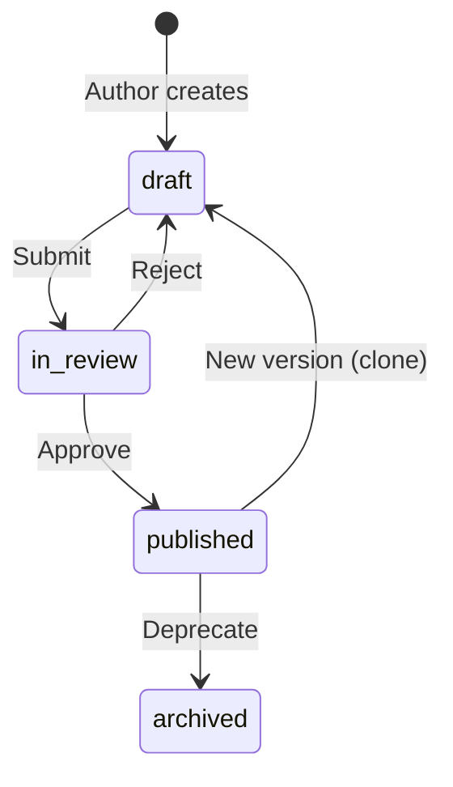
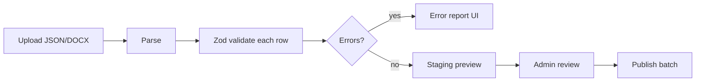
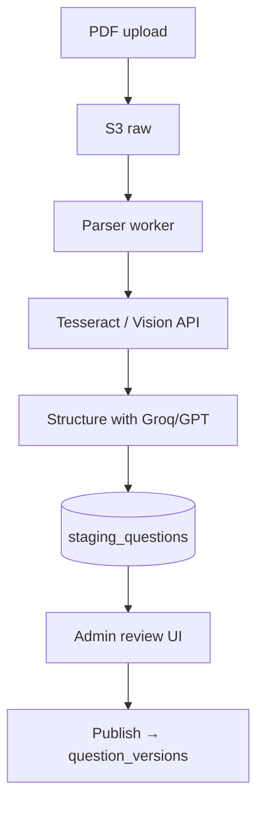

# EdTech Question Platform — Production Architecture

Senior-level blueprint for **Exam Question Bank + Rendering Engine + Admin CMS + Bulk/OCR Import**, aligned with Testbook / Unacademy / PW-scale patterns.

**Current repo status:** Phase **1** (modular monolith) is partially implemented in this Next.js app. Phase **2–3** split apps per below.

---

## 0. Executive summary

| Layer | Technology | Responsibility |
|-------|------------|----------------|
| **frontend-user** | Next.js 14 (App Router) | Practice, mock, timer, bookmarks, analytics, `QuestionRenderer` |
| **frontend-admin** | Next.js 14 (separate app) | TipTap CMS, bulk upload UI, OCR review queue |
| **backend-api** | Node + Express + TypeScript + Prisma | Auth, CRUD, versioning, search, publish, import jobs |
| **question-parser-service** | Node worker (BullMQ) | PDF→OCR→LLM→staging JSON |
| **shared-types** | TypeScript + Zod | `QuestionDocument`, API contracts, validators |
| **question-renderer** (package) | React + KaTeX | Shared render tree (user + admin preview) |

**Canonical content format:** `RichContent { format: "tiptap-v1", doc: ProseMirror JSON, plainText }` + **LaTeX source** in math nodes (never stored as rendered HTML).

---

## 1. System architecture

### Why separate applications?

```
┌─────────────────┐     ┌─────────────────┐     ┌──────────────────────┐
│  frontend-user  │     │ frontend-admin  │     │ question-parser-svc  │
│  (read-heavy)   │     │ (write-heavy)     │     │ (CPU/GPU, async)     │
└────────┬────────┘     └────────┬────────┘     └──────────┬───────────┘
         │                       │                          │
         │    HTTPS / REST       │                          │
         └───────────────────────┼──────────────────────────┘
                                 ▼
                    ┌────────────────────────┐
                    │      backend-api       │
                    │  PostgreSQL + Redis    │
                    │  S3/Cloudinary assets  │
                    └────────────────────────┘
```

| Separation | Reason |
|------------|--------|
| **User vs Admin** | Different SLAs, bundle size (no TipTap on student phones), security boundary (admin never ships to CDN with student traffic) |
| **API vs Frontends** | Multiple clients (web, future mobile), centralized auth & validation |
| **Parser service** | OCR/LLM is bursty, scales horizontally without touching API latency |
| **shared-types** | Single source of truth for question schema across all services |

### Monorepo choice: **pnpm workspaces + Turborepo**

| Option | Verdict |
|--------|---------|
| Multi-repo | ❌ Schema drift, painful coordinated releases |
| Nx | ⚠️ Powerful but heavy for 4–5 packages |
| **pnpm + Turborepo** | ✅ **Recommended** — fast installs, cacheable builds, simple task graph |
| Plain yarn workspaces | ⚠️ OK but slower, weaker task orchestration |

**Why Turborepo:** `turbo build` caches `packages/shared-types` → both frontends; `turbo dev` runs api + web in parallel.

---

## 2. Folder structure (target monorepo)

```
gate-platform/
├── apps/
│   ├── frontend-user/              # Student exam UI (Next.js)
│   │   ├── app/
│   │   │   ├── practice/
│   │   │   ├── mock/
│   │   │   ├── exam/[sessionId]/   # timed attempt
│   │   │   └── analysis/
│   │   ├── components/exam/
│   │   └── lib/api-client.ts
│   │
│   ├── frontend-admin/             # CMS (Next.js)
│   │   ├── app/
│   │   │   ├── questions/
│   │   │   ├── import/             # bulk JSON/DOCX
│   │   │   ├── staging/            # OCR review
│   │   │   └── publish/
│   │   └── components/editor/      # TipTap
│   │
│   ├── backend-api/                # Express + Prisma
│   │   └── src/
│   │       ├── modules/
│   │       │   ├── questions/
│   │       │   ├── imports/
│   │       │   ├── staging/
│   │       │   ├── media/
│   │       │   └── search/
│   │       ├── middleware/
│   │       └── index.ts
│   │
│   └── question-parser-service/    # Workers
│       └── src/
│           ├── pipelines/pdf-ocr.ts
│           ├── pipelines/llm-structure.ts
│           └── workers/import-job.ts
│
├── packages/
│   ├── shared-types/               # Zod + TS contracts
│   ├── question-renderer/          # React render components
│   └── eslint-config/              # shared lint
│
├── prisma/
│   └── schema.prisma               # single schema (used by api + workers)
├── turbo.json
├── pnpm-workspace.yaml
└── docs/
    └── EDTECH_QUESTION_PLATFORM.md
```

**Migration from current repo:** Root Next.js app = `apps/frontend-user` + temporary `/admin` routes until `frontend-admin` is split.

---

## 3. User panel architecture

### Rendering pipeline (read path)

```
GET /v1/questions/:id
  → API returns QuestionDocument (published version)
  → Adapter maps to ExamQuestionViewModel
  → <QuestionRenderer stem={rich} />
  → RichContentRenderer walks TipTap JSON
       ├── text marks
       ├── inlineMath / blockMath → KaTeX (client)
       ├── image → next/image lazy
       ├── table → responsive scroll
       └── codeBlock → lowlight
```

### Exam session model

```typescript
ExamSession {
  id, userId, examType, questionIds[], 
  startedAt, durationSec, 
  answers: Record<questionId, AnswerPayload>,
  status: 'active' | 'submitted'
}
```

**UI modules:** `ExamShell`, `QuestionNavigator` (pagination grid), `TimerBar`, `QuestionRenderer`, `AnswerPanel` (MCQ/MSQ/NAT), `SolutionDrawer` (post-submit).

**Performance:** Virtualized question palette (`@tanstack/react-virtual`); fetch questions page-wise `?cursor=&limit=20`.

---

## 4. Admin CMS (most important)

### Editor: **TipTap** (ProseMirror)

| Editor | Verdict |
|--------|---------|
| **TipTap** | ✅ Tables, math, images, code, collaborative-ready, JSON round-trip |
| Lexical | Strong; fewer off-the-shelf exam templates |
| Slate | More DIY |
| EditorJS | Block-only; poor inline math |

### CMS workflow



**Features implemented / planned:**

| Feature | Status |
|---------|--------|
| TipTap stem/solution | ✅ `components/admin/RichTextEditor.tsx` |
| Live preview | ✅ `QuestionPreview` |
| Autosave 30s | ✅ `QuestionForm` |
| Draft/publish | ✅ API + store |
| Image upload | ✅ `/api/admin/upload` |
| Bulk JSON import | ✅ `/api/admin/import` (this PR) |
| OCR staging review | ✅ `/admin/staging` |
| DOCX import | Phase 3 (mammoth → blocks) |

---

## 5. Question storage format (canonical)

**Do not store HTML or KaTeX output as source of truth.**

```json
{
  "stem": {
    "format": "tiptap-v1",
    "plainText": "Fineness modulus is 2.8 ...",
    "doc": { "type": "doc", "content": [ ... ] }
  }
}
```

| Representation | Role |
|----------------|------|
| **TipTap JSON** | Canonical editable + renderable |
| **plainText** | FTS search, OCR diff, AI embeddings |
| **LaTeX in attrs** | `inlineMath`, `blockMath` |
| **HTML** | Export/PDF only, never canonical |
| **Markdown** | Optional import/export |

---

## 6. Data model & versioning

See `prisma/schema.prisma` for full DDL.

**Versioning strategy (Testbook-style):**

- `questions` = logical identity (`slug`, metadata)
- `question_versions` = immutable content rows (`version`, `stem`, `options`, `solution`)
- `published_version_id` pointer on `questions`
- Edits create **new version**; attempts reference `version_id` they were served

**Bulk import batch:**

- `import_batches` → `import_rows` (raw + validation errors + `staging_id`)

---

## 7. Rendering engine components

| Component | File (current) |
|-----------|----------------|
| QuestionRenderer | `components/question-renderer/QuestionRenderer.tsx` |
| RichContentRenderer | `RichContentRenderer.tsx` |
| OptionRenderer | `OptionRenderer.tsx` |
| SolutionRenderer | `SolutionRenderer.tsx` |
| EquationBlock | `EquationBlock.tsx` (KaTeX) |
| ImageBlock | `ImageBlock.tsx` |
| TableBlock | `TableBlock.tsx` |
| CodeBlock | `CodeBlock.tsx` |

**Security:** No raw HTML from users; `sanitizeHtml()` for legacy; KaTeX `trust: false`.

---

## 8. Bulk import system



**Canonical import JSON** = array of `QuestionDocument` (see `data/question-bank/example-question.json`).

**API:** `POST /api/admin/import` → returns `{ batchId, accepted, rejected, errors[] }`.

---

## 9. OCR pipeline



**Duplicate detection:** SimHash on `plainText` + subject; flag `duplicate_of_id`.

---

## 10. Images & equations

| Asset | Store | Serve |
|-------|-------|-------|
| Images | S3/Cloudinary key in DB | CDN URL, `next/image`, WebP variants |
| Equations | **LaTeX string only** | KaTeX render at runtime |
| Never store | KaTeX HTML, SVG snapshots | Breaks themes, XSS surface |

---

## 11. Security

| Threat | Mitigation |
|--------|------------|
| XSS | TipTap JSON walk + DOMPurify for HTML nodes only |
| Admin access | JWT/httpOnly cookie, RBAC (`admin`, `editor`, `reviewer`) |
| Uploads | MIME sniff, size cap, virus scan (ClamAV) at scale |
| API | Rate limit, Zod on all inputs, IDOR checks on `questionId` |

---

## 12. Performance at scale

| Concern | Strategy |
|---------|----------|
| List 100k+ questions | Cursor pagination, `status=published` partial index |
| Search | PostgreSQL `tsvector` on `plainText` + GIN `tags` |
| Hot sets | Redis cache `subject:GATE:page:1` TTL 5m |
| Images | CDN + lazy + blur placeholder |
| Admin lists | Virtualized tables |
| Parser | Queue depth metrics, autoscale workers |

---

## 13. Backend API design

**Base:** `https://api.example.com/v1`

| Method | Path | Description |
|--------|------|-------------|
| GET | `/questions` | List published (cursor, filters) |
| GET | `/questions/:id` | Published version |
| POST | `/admin/questions` | Create draft |
| PUT | `/admin/questions/:id` | Update → new version |
| POST | `/admin/questions/:id/publish` | Set published pointer |
| POST | `/admin/import/json` | Bulk upload |
| GET | `/admin/staging` | OCR queue |
| PATCH | `/admin/staging/:id` | Approve/reject |
| POST | `/admin/media/upload` | Presigned S3 URL |

**Layering:**

```
Controller → Service (business rules) → Repository (Prisma) → PostgreSQL
                ↓
            Validator (Zod from shared-types)
```

Skeleton: `apps/backend-api/`.

---

## 14. Implementation phases

| Phase | Scope | Timeline |
|-------|-------|----------|
| **1** | Modular monolith (current): TipTap CMS, renderer, JSON store, admin APIs | ✅ Now |
| **2** | PostgreSQL + Prisma + Express API; migrate off JSON files | Next |
| **3** | Split `frontend-admin`; BullMQ parser service | |
| **4** | CDN, Redis, FTS, duplicate detection | |
| **5** | Mobile API consumers, AI question generation | |

---

## Sample canonical question

See `data/question-bank/example-question.json` and `packages/shared-types/src/question.schema.ts`.
